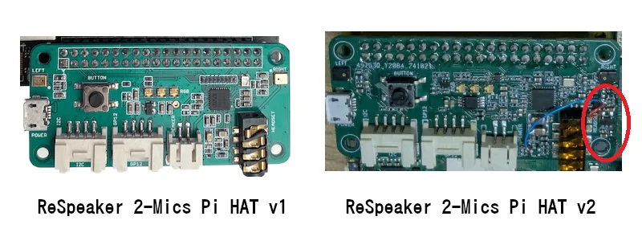

# Hardware - ReSpeaker 2-Mics Pi HAT v1

</img>

Features:
- Support the Raspberry Pi 3B,4B
- Two microphones (Mic L and Mic R)
- Two Grove connectors
- One User-defined button
- 3.5mm audio interface
- XH2.54-2P audio output interface

## Order

### Base:

- [Raspberry Pi Zero 2 W](https://amzn.to/3M0G4hC)
- [SD-Card](https://amzn.to/4qfx06l)
- [US MicroUSB Power Supply](https://amzn.to/4c52mt3)
- [Cable for Speaker](https://amzn.to/3ZvU0Dz)

### ReSpeaker 2-Mics Pi HAT v1

- [ReSpeaker 2Mic HAT](https://wiki.keyestudio.com/Ks0314_keyestudio_ReSpeaker_2-Mic_Pi_HAT_V1.0)

## Additional information:

- [Wiki](https://github.com/Seeed-Studio/wiki-documents/blob/docusaurus-version/docs/Sensor/ReSpeaker_2-Mics_Pi_HAT/v1-deprecated/ReSpeaker_2_Mics_Pi_HAT_Raspberry.md)
- [Keyestudio documentation](https://docs.keyestudio.com/projects/KS0314/en/latest/docs/KS0314.html#overview)
