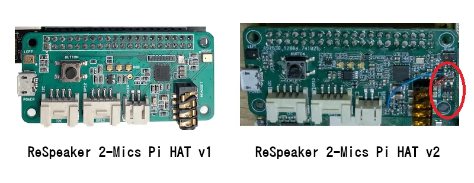

# Hardware - ReSpeaker 2-Mics Pi HAT v2.0

</img>

The V2.0 is a silent hardware revision of the 2-Mics Pi HAT. Visually identical, electrically different: the WM8960 codec used on v1 (I2C `0x1a`) is replaced with a **TLV320AIC3104** codec (I2C `0x18`). This matters because the v1 driver stage does not produce a working sound card on v2 hardware, and because the mixer defaults differ.

Features (same as v1):
- Support the Raspberry Pi 3B / 4B / Zero 2 W
- Two microphones (Mic L and Mic R)
- Two Grove connectors
- One User-defined button
- 3.5 mm audio interface
- XH2.54-2P audio output interface

## Order

### Base:

- [Raspberry Pi Zero 2 W](https://amzn.to/3M0G4hC)
- [SD-Card](https://amzn.to/4qfx06l)
- [US MicroUSB Power Supply](https://amzn.to/4c52mt3)
- [Cable for Speaker](https://amzn.to/3ZvU0Dz)

### ReSpeaker 2-Mics Pi HAT v2.0

- [Seeed Studio ReSpeaker 2-Mics Pi HAT V2.0](https://wiki.seeedstudio.com/respeaker_2_mics_pi_hat_v2/)

## Technical notes

Unlike v1 — which needs an out-of-tree DKMS kernel module — v2 uses the mainline `snd-soc-tlv320aic3x` driver that already ships with the Raspberry Pi OS kernel. The image only needs:

1. The device-tree overlay `respeaker-2mic-v2_0.dtbo` (built from [Seeed-Studio/seeed-linux-dtoverlays](https://github.com/Seeed-Studio/seeed-linux-dtoverlays)), enabled via `dtoverlay=respeaker-2mic-v2_0` in `/boot/firmware/config.txt`.
2. `dtparam=i2c_arm=on` in `/boot/firmware/config.txt`.
3. Mixer tuning on first boot — the TLV320 ships with three separate attenuators all well below 100 % (`HP DAC` at -23.5 dB in particular), producing a card that appears to work but is inaudible at typical application volumes.

The PiCompose `02-stage-audiodriver-2michat-v2` stage performs all three steps automatically. The mixer tuning is applied by `configure_audio.service` on every boot: PipeWire / WirePlumber manage ALSA state per session and can reset the mixer between reboots, so a first-boot-only guard would let users end up stuck at 0%. Customization via `amixer` is still possible at runtime — it just won't survive a reboot.

## Additional information

- [Seeed Studio Wiki — ReSpeaker 2-Mics Pi HAT v2.0](https://wiki.seeedstudio.com/respeaker_2_mics_pi_hat_v2/)
- [seeed-linux-dtoverlays (overlay source)](https://github.com/Seeed-Studio/seeed-linux-dtoverlays)
