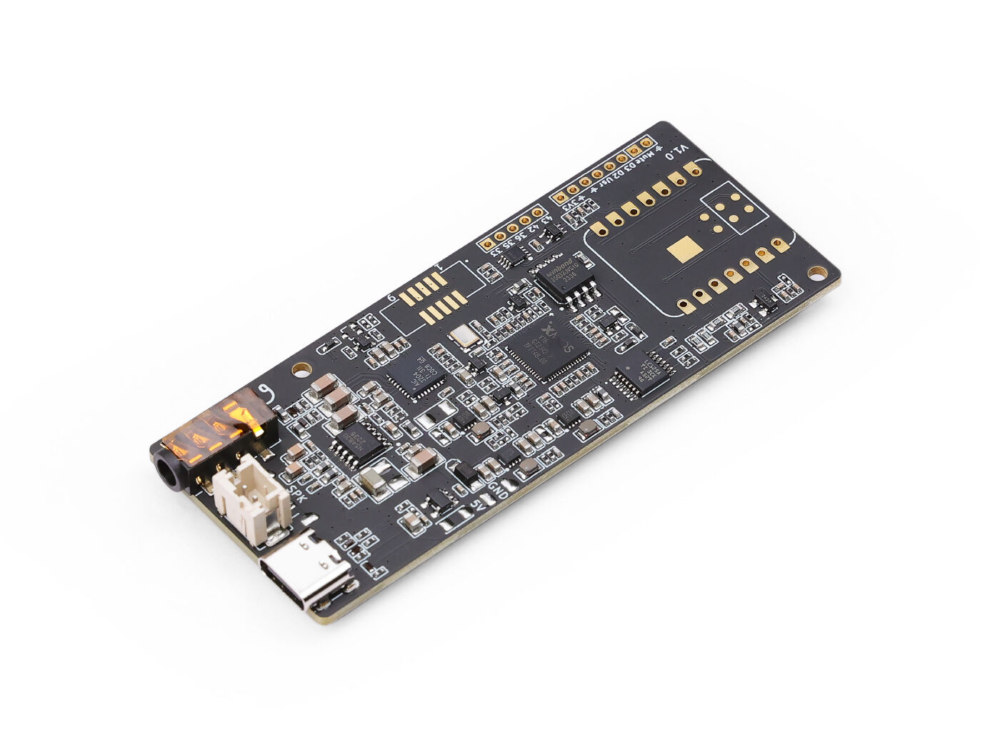

# Hardware - Respeaker Lite

</img>

Features:
- Acoustic Echo Cancellation (AEC)
- Automatic Gain Control (AGC)
- Noise Suppression (NS)
- Interference Cancellation (IC)
- Voice-to-Noise Ratio (VNR)

## Order

### Base:

- [Raspberry Pi Zero 2 W](https://amzn.to/3M0G4hC)
- [SD-Card](https://amzn.to/4qfx06l)
- [US MicroUSB Power Supply](https://amzn.to/4c52mt3)
- [Cable for Speaker](https://amzn.to/3ZvU0Dz)

### Mic Array (ReSpeaker Lite Board):

- [ReSpeaker Lite](https://www.seeedstudio.com/ReSpeaker-Lite-p-5928.html?srsltid=AfmBOopODKrejEe7WIXSLV5fjLuhhK8PO-AXG3WnDI1N1pwBu-PTWQHf)
- [USB-Cable](https://de.aliexpress.com/item/1005004792246478.html?spm=a2g0o.order_list.order_list_main.5.4dac5c5fKkDzIc&gatewayAdapt=glo2deu)

## Important information:

### Workaround:

In connection with the Raspberry Pi Zero 2W there is a bug in RPI-OS where the board stops working after 7 or 8 sound outputs with a reconnect to the audio card. I implemented a workaround for that where a constant not hearable output is played to the card.

### Firmware:

In order to use this board with the Raspberry Pi Zero 2W you need to flash the usb-firmware.  
More information in the official Seeedstudio Wiki. 
I am currently running the [respeaker_lite_usb_dfu_firmware_v2.0.7.bin](https://github.com/respeaker/ReSpeaker_Lite/blob/master/xmos_firmwares/respeaker_lite_usb_dfu_firmware_v2.0.7.binhttps:/)

## Additional information:

- [Respeaker Wiki](https://wiki.seeedstudio.com/reSpeaker_usb_v3/)
