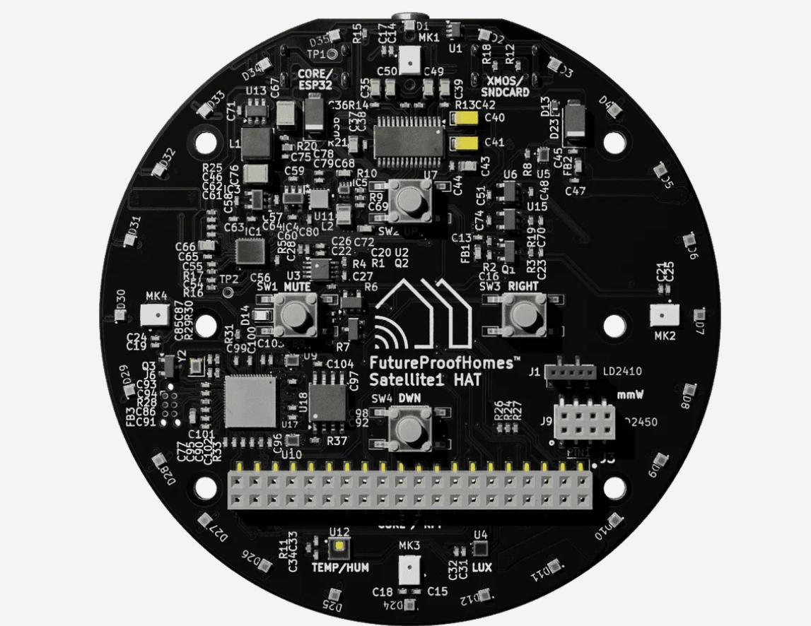

# Hardware - Satellite1

</img>

Features:
- Microphone Processing: High-performance microphones with an XMOS audio processing chip. 
- Audio Output: Supports high-quality Snapcast multi-room music playback via the powerful 25W built-in amplifier or headphone jack.
- Controls: 4 programmable tactile buttons, including hardware mute for privacy.  360 degree addressable LED ring.
- Sensors: Monitors room temperature, humidity, luminosity, and human presence (when paired with a mmWave radar sensor).
- Radios: Built-in 2.4 GHz Wi-Fi and Bluetooth® 5 (LE).
- Expandable: FX23L expansion connector for future accessories.
- Compatible: Works with Home Assistant, Music Assistant
- Audio Processor: XMOS XU316, 16-core 32-bit RISC running at 800 MHz with 3200 MIPS, 1024 KB SRAM, and 8 MB Flash.

## Order

What you need to buy:

### Base:

- [Raspberry Pi Zero 2 W](https://amzn.to/3M0G4hC)
- [SD-Card](https://amzn.to/4qfx06l)

### Satellite1 HAT Board:

- [Satellite1 HAT Board](https://futureproofhomes.net/products/satellite1-top-microphone-board)
- [9V 3A Power Supply for US](https://amzn.to/49RDELn)

## Speaker:

- [Whole Speaker kit](https://futureproofhomes.net/products/satellite1-smart-speaker-enclosure-kit)

Or if you want to print it yourself:

- [Speaker](https://amzn.to/4k9gkfu) or [Aliexpress](https://de.aliexpress.com/item/1005011560142502.html?spm=a2g0o.productlist.main.3.33c9JJacJJacEB&algo_pvid=64814943-53f2-4063-858b-24b8bff7bd47&algo_exp_id=64814943-53f2-4063-858b-24b8bff7bd47-2&pdp_ext_f=%7B%22order%22%3A%22-1%22%2C%22eval%22%3A%221%22%2C%22fromPage%22%3A%22search%22%7D&pdp_npi=6%40dis%21EUR%217.78%213.89%21%21%2162.89%2131.44%21%402103868817699707030983290ea297%2112000055921741746%21sea%21DE%21797676231%21X%211%210%21n_tag%3A-29919%3Bd%3A64670a7c%3Bm03_new_user%3A-29895&curPageLogUid=uNvseW668v4i&utparam-url=scene%3Asearch%7Cquery_from%3A%7Cx_object_id%3A1005011560142502%7C_p_origin_prod%3A)
- Optional: [Alternative Speaker](https://amzn.to/3ZIgnFA)
- [Cable for Speaker](https://amzn.to/3ZvU0Dz)
- [Crossover](https://de.aliexpress.com/item/1005006342929950.html?invitationCode=RElGaGNTVnp5aVh0S3dka2VST2FHR2l1eUNRV2NZcThRWmgvWnRFdUtnYWVQemFTZUJrNWVWT0s1MU1hdTAyWg&srcSns=sns_Copy&spreadType=socialShare&social_params=61399346706&bizType=ProductDetail&spreadCode=RElGaGNTVnp5aVh0S3dka2VST2FHR2l1eUNRV2NZcThRWmgvWnRFdUtnYWVQemFTZUJrNWVWT0s1MU1hdTAyWg&aff_fcid=2fae6e0ee0d445b393d87f5cf6411c9f-1769967697975-07738-_EIJyBko&tt=MG&aff_fsk=_EIJyBko&aff_platform=default&sk=_EIJyBko&aff_trace_key=2fae6e0ee0d445b393d87f5cf6411c9f-1769967697975-07738-_EIJyBko&shareId=61399346706&businessType=ProductDetail&platform=AE&terminal_id=29ee5f8658dd4e0898da1a1fba47d83e&afSmartRedirect=y)
- [Tweeter](https://amzn.to/4k9gHXq) or [Aliexpress](https://de.aliexpress.com/item/1005008134122115.html?spm=a2g0o.productlist.main.1.593aGJ4bGJ4bug&algo_pvid=d39a4e60-913d-4c2c-b30e-7b5e0f643b71&algo_exp_id=d39a4e60-913d-4c2c-b30e-7b5e0f643b71-0&pdp_ext_f=%7B%22order%22%3A%225%22%2C%22eval%22%3A%221%22%2C%22fromPage%22%3A%22search%22%7D&pdp_npi=6%40dis%21EUR%218.05%218.05%21%21%219.37%219.37%21%40211b61ae17699713550016574ea8ce%2112000043930964935%21sea%21DE%21797676231%21X%211%210%21n_tag%3A-29919%3Bd%3A64670a7c%3Bm03_new_user%3A-29895&curPageLogUid=QHG13DgSQL42&utparam-url=scene%3Asearch%7Cquery_from%3A%7Cx_object_id%3A1005008134122115%7C_p_origin_prod%3A)
- [Insulation](https://amzn.to/4t7Gtj3)

## Additional information:

- [Hardware Documentation](https://docs.futureproofhomes.net/satellite1-assembly/#first-boot-powering-on)
- [Speaker Enclosure](https://docs.futureproofhomes.net/satellite1-smart-speaker-enclosure-kit/)
- [OEM 3D Print Design](https://github.com/FutureProofHomes/Satellite1-Enclosures/tree/main/OEM%20Enclosures/Satellite1%20Smart%20Speaker%20Enclosure%20Kit)
