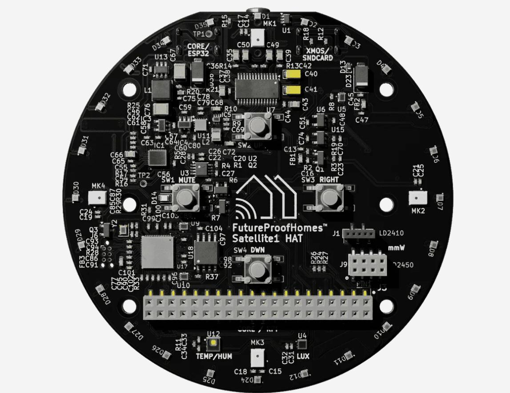

# Hardware - Satellite1

</img>

Features:
- Microphone Processing: High-performance microphones with an XMOS audio processing chip. 
- Audio Output: Supports high-quality Snapcast multi-room music playback via the powerful 25W built-in amplifier or headphone jack.
- Controls: 4 programmable tactile buttons, including hardware mute for privacy. 360 degree addressable LED ring.
- Sensors: Monitors room temperature, humidity, luminosity, and human presence (when paired with a mmWave radar sensor).
- Radios: Built-in 2.4 GHz Wi-Fi and Bluetooth® 5 (LE).
- Expandable: FX23L expansion connector for future accessories.
- Compatible: Works with Home Assistant, Music Assistant
- Audio Processor: XMOS XU316, 16-core 32-bit RISC running at 800 MHz with 3200 MIPS, 1024 KB SRAM, and 8 MB Flash.

## Order Options

### Full Kit

Buy the [full kit](https://futureproofhomes.net/products/satellite1-smart-speaker) and add a Raspberry Pi Zero 2 WH.

### Individual Parts

💡 **Note:** You will need to buy a Pi Zero 2 board with the pins already attached (WH version) to use a HAT board. You can buy the Pi board with factory-installed pins from authorized resellers, or use a hammer-in kit to install the pins on the board. There are probably a few adventurous souls that want to solder in the pins but I expect that most people won't.

| Part | Primary Source | Alternative Sources |
|------|------------------|---------------------|
| Satellite1 HAT Board | [FutureProofHomes](https://futureproofhomes.net/products/satellite1-1-hat-board) | - |
| Raspberry Pi Zero 2 WH or Raspberry Pi Zero 2 W | - | [Amazon](https://amzn.to/3M0G4hC) |
| Charger | [FutureProofHomes](https://futureproofhomes.net/products/30w-usb-c-pd-charger) | [Amazon: Anker Nano Charger](https://www.amazon.com/dp/B0B2MLRF93) |
| Charger Cable (USB-C) | [FutureProofHomes](https://futureproofhomes.net/products/usb-c-cable) | - |
| SD Card | - | [Amazon](https://amzn.to/4qfx06l) |
| Speaker | [FutureProofHomes](https://futureproofhomes.net/products/3-inch-woofer-4ohm-20w) | [Amazon](https://www.amazon.com/dp/B0822XCPT8), [Aliexpress](https://s.click.aliexpress.com/e/_c33mJJNH) |
| Tweeter | [FutureProofHomes](https://futureproofhomes.net/products/tweeter-4ohm-20w) | [Amazon](https://amzn.to/4k9gHXq), [Aliexpress](https://de.aliexpress.com/item/1005008134122115.html) |
| Two Way Speaker Crossover Board | [FutureProofHomes](https://futureproofhomes.net/products/two-way-speaker-crossover) | [Aliexpress](https://de.aliexpress.com/item/1005006342929950.html) |
| Speaker Cable 2x | [FutureProofHomes (Red)](https://futureproofhomes.net/products/4-8mm-spade-cable-red), [FutureProofHomes (Black)](https://futureproofhomes.net/products/2-8mm-spade-cable-black) | - |
| JST Connector | [FutureProofHomes](https://futureproofhomes.net/products/jst-xh-2-54mm-2-pin-male-connector) | [Amazon](https://amzn.to/3TC4Urq) |
| Screws | [FutureProofHomes](https://futureproofhomes.net/products/m3x10mm-hex-socket-head-cap-screws) | [Amazon](https://amzn.to/3RiytxE) |
| Sealing Foam | [FutureProofHomes](https://futureproofhomes.net/products/epdm-sealing-foam-strip) | [Amazon](https://amzn.to/4yHYA1I) |
| OEM 3D Print Design | [FutureProofHomes GitHub](https://github.com/FutureProofHomes/Satellite1-Enclosures/tree/main/OEM%20Enclosures/Satellite1.1%20Smart%20Speaker%20Enclosure%20Kit) | - |

## Additional Information

- [Hardware Documentation](https://docs.futureproofhomes.net/satellite1-assembly/#first-boot-powering-on)
- [How to build the Speaker Enclosure](https://docs.futureproofhomes.net/satellite1-smart-speaker-enclosure-kit/)
- [Alternative 3D Designs](https://docs.futureproofhomes.net/satellite1-squircle-enclosures) - Compatible with [alternative speakers](https://amzn.to/4pGP4rp)